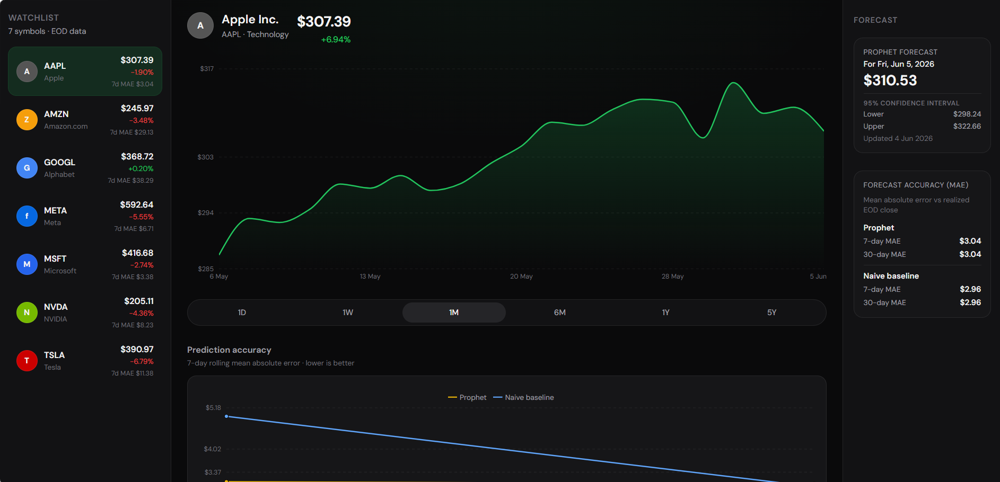
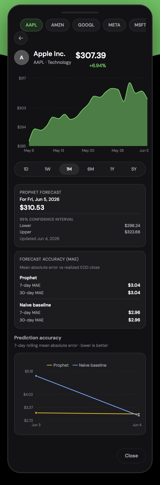
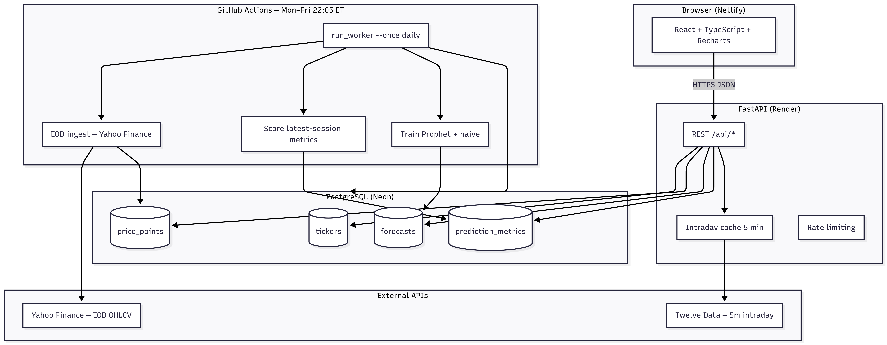
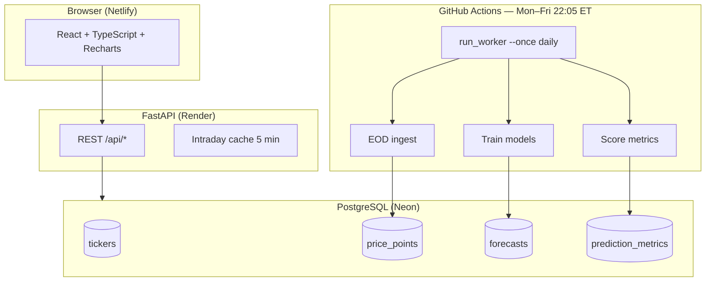

# Financial Analytics Dashboard

 **Live Demo:** https://resilient-boba-64a3aa.netlify.app

Full-stack stock watchlist and forecasting dashboard: EOD ingestion, Prophet + naive models, accuracy tracking, and a React UI with live intraday quotes.

**Stack:** React · FastAPI · PostgreSQL · Prophet · GitHub Actions  
**Deployed:** Netlify (frontend) · Render (API) · Neon (database)

<p align="center">
  
</p>
<p align="center"><em>Desktop: watchlist, EOD chart, Prophet forecast panel, and 7d/30d MAE</em></p>

## At a glance

- **Watchlist** : Seven US equities with live session prices and Prophet 7-day MAE
- **Charts** — EOD history (1W–5Y) and 5-minute intraday (1D)
- **Forecasts** : Next-session close from Prophet (95% interval) and a naive benchmark
- **Accuracy** : Daily error in Postgres, rolling MAE trend chart, model comparison
- **Automation** : Nightly worker: ingest → score forecasts → retrain

<p align="center">
  
</p>

## Prediction timing

| Event | When (US Eastern) | What happens |
|-------|-------------------|--------------|
| **Market session** | Mon–Fri 9:30 AM – 4:00 PM | Intraday bars from Twelve Data; 1D chart can show a live Prophet target until close |
| **Nightly worker** | Mon–Fri **10:05 PM** | GitHub Actions: ingest EOD → score metrics → retrain Prophet + naive |
| **Forecast target** | Next **trading day** close | Both models predict the **next session’s EOD close**, not an intraday path |
| **Metrics scoring** | After EOD is ingested | Stored forecast vs realized `price_points.close` for that session |

## Architecture

<p align="center">
  
</p>



- **EOD data** : Yahoo Finance → Postgres (worker)
- **Intraday** : Twelve Data → API memory cache (not persisted)
- **CORS** : production API restricted to the Netlify frontend origin

---

## Tech stack

| Layer | Technologies |
|-------|----------------|
| Frontend | React 18, TypeScript, Vite, Recharts |
| Backend | FastAPI, SQLAlchemy 2, Alembic, Pydantic |
| ML | Prophet (CmdStan), pandas |
| Database | PostgreSQL |
| Worker | GitHub Actions |
| Hosting | Netlify, Render, Neon |

---

## API

| Endpoint | Purpose |
|----------|---------|
| `GET /api/summary` | Watchlist snapshot |
| `GET /api/prices/{symbol}` | EOD candles |
| `GET /api/forecasts/{symbol}` | Prophet + naive |
| `GET /api/intraday/{symbol}` | 5-minute session bars |
| `GET /api/metrics` | 7d / 30d MAE |
| `GET /api/metrics/{symbol}/trend` | Error history for trend chart |

---

## Local development

```bash
# Backend
cd backend && pip install -r requirements.txt
alembic upgrade head && python -m app.scripts.ingest_prices
uvicorn app.main:app --reload

# Frontend
cd frontend && npm install && npm run dev
# Set VITE_API_BASE_URL=http://127.0.0.1:8000

# Worker (manual)
python -m app.scripts.run_worker --once daily
python -m app.scripts.run_worker --once metrics-backfill   # historical accuracy
```

---

## Limitations

Portfolio / learning project—not a production trading system.

1. **Not financial advice** — experimental forecasts only
2. **Seven symbols** — no auth or custom watchlists
3. **Univariate EOD** — close price only; no sentiment or macro features
4. **Next-close only** — not intraday paths or multi-day horizons
5. **External data** — Yahoo Finance (EOD), Twelve Data (intraday)
6. **US regular session** — 9:30 AM–4:00 PM ET, weekdays
7. **Metrics cold start** — accuracy charts need backfill + several trading days
8. **Free-tier hosting** — Render/Neon sleep and runtime limits apply

---

## Project structure

```
stock-predictor/
├── backend/            # FastAPI, models, worker, Alembic
├── frontend/           # React SPA
├── docs/screenshots/   # README images
├── .github/workflows/  # CI + nightly worker
└── render.yaml         # Render API blueprint
```

